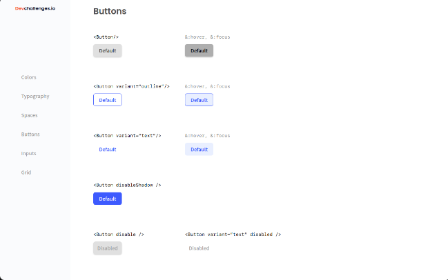

<h1 align="center">{Button Component}</h1>

<div align="center">
   Solution for a challenge from  <a href="http://devchallenges.io" target="_blank">Devchallenges.io</a>.
</div>

<div align="center">
  <h3>
    <a href="https://button-component-alpha-lyart.vercel.app/">
      Demo
    </a>
    <span> | </span>
    <a href="https://legacy.devchallenges.io/paths/front-end-developer/solutions">
      Solution
    </a>
    <span> | </span>
    <a href="https://devchallenges.io/challenges/ohgVTyJCbm5OZyTB2gNY">
      Challenge
    </a>
  </h3>
</div>

<!-- TABLE OF CONTENTS -->

## Table of Contents

- [Overview](#overview)
  - [Built With](#built-with)
- [Features](#features)
- [How to use](#how-to-use)
- [Contact](#contact)
- [Acknowledgements](#acknowledgements)

<!-- OVERVIEW -->

## Overview


<!--  -->

> 💻 In this project, I created a button styles library using **React**, a JavaScript library for building user interfaces.
> 
> 📑The goal was to replicate the design of a provided webpage using **React components** for the buttons. 
> To achieve a responsive and adaptable design, I used display grid, a CSS technique that enables the creation of flexible layouts. 
> I also utilized props, a way of passing data between components, to customize the styles and content of the buttons. The result was a webpage displaying a variety of buttons with different sizes, colors, shapes, and effects
>  
> ⚠️ The webpage is purely visual and lacks any interaction with the user..
>  
> 💡This project allowed me to practice my React and CSS skills.

### Built With

<!-- This section should list any major frameworks that you built your project using. Here are a few examples.-->

- [React](https://reactjs.org/)

## Features

<!-- List the features of your application or follow the template. Don't share the figma file here :) -->

This application/site was created as a submission to a [DevChallenges](https://devchallenges.io/challenges) challenge. The [challenge](https://devchallenges.io/challenges/ohgVTyJCbm5OZyTB2gNY) was to build an application to complete the given user stories.

## How To Use

<!-- This is an example, please update according to your application -->

<To clone and run this application, you'll need [Git](https://git-scm.com) and [Node.js](https://nodejs.org/en/download/) (which comes with [npm](http://npmjs.com)) installed on your computer. From your command line:

```bash
# Clone this repository
$ git clone https://github.com/Leydisfh/Button-component

# Install dependencies
$ npm install

# Run the app
$ npm start
```

## Acknowledgements

<!-- This section should list any articles or add-ons/plugins that helps you to complete the project. This is optional but it will help you in the future. For exmpale -->

- [Steps to replicate a design with only HTML and CSS](https://devchallenges-blogs.web.app/how-to-replicate-design/)
- [Node.js](https://nodejs.org/)
- [Marked - a markdown parser](https://github.com/chjj/marked)

## Contact
- GitHub [@leydisfh](https://github.com/Leydisfh)
- Linkedin [@leydis-fernández](https://linkedin.com/in/leydis-fernández)
